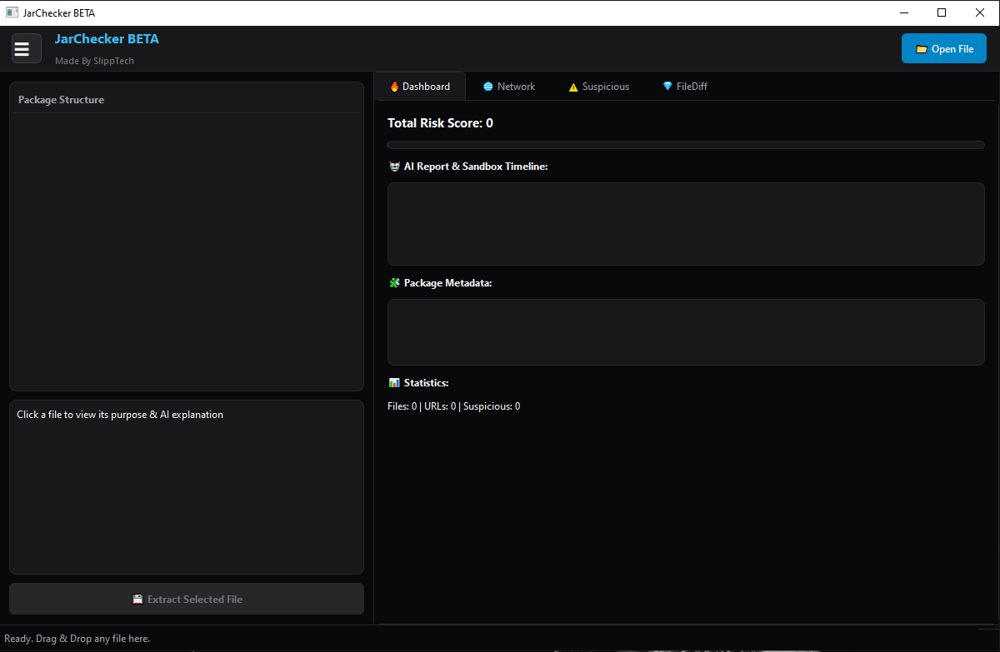

# JarChecker
What is JarChecker?  JarChecker is a modern file analysis tool designed to help users inspect, understand, and verify the contents of files before opening them.  Originally built for Java JAR files and Minecraft mods.

  

 

  <a href="https://www.reddit.com/r/JarChecker/">
    
    JOIN US ON REDDIT
  </a>

